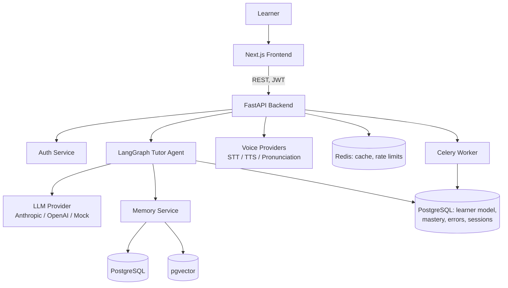
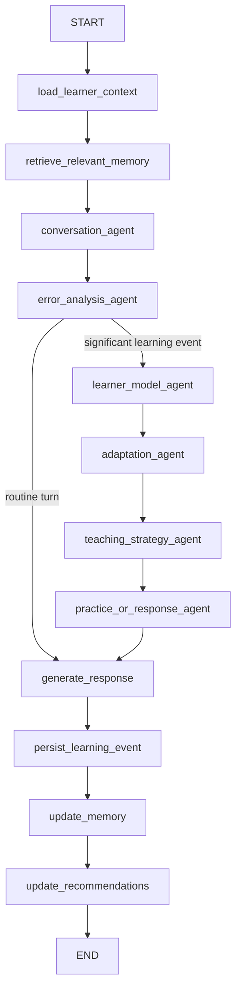

# Architecture

## System overview



## Why a modular monolith, not microservices

Section 106 of the brief is explicit about this, and it's the right call at this scale: one FastAPI app, one Next.js app, one Postgres, one Redis, one worker process. Agent logic is internally modular (`app/agents/`, `app/ai/`, `app/learning/`, `app/memory/`, `app/voice/`) so it *could* be split out later, but there's no operational reason to pay the network/deploy complexity tax yet.

## The agent graph

See [AGENTS.md](AGENTS.md) for the full node-by-node breakdown. Summary:



The conditional edge out of `error_analysis_agent` is the cost-optimization step described in section 42 of the brief: a routine, error-free conversational turn never calls the adaptation or teaching-strategy LLM prompts, because there's nothing new to adapt to.

## Request lifecycle (a chat message)

1. `POST /api/v1/chat/message` — a Redis-backed `RateLimit` dependency (`app/core/rate_limit.py`) checks the caller isn't over their per-minute cap before anything else runs.
2. `app/api/v1/chat.py` resolves the caller's own `LearnerProfile` via `core/deps.get_learner_profile` (never accepts a client-supplied learner id).
3. `app/services/chat_service.py` loads/creates the `LearningSession` (emitting a `conversation_started` `AnalyticsEvent` if new), pulls recent message history, and builds the initial `TutorState`.
4. `app/agents/graph.py` compiles a fresh graph bound to that request's `AsyncSession` and runs it.
5. Each node reads/writes a typed slice of `TutorState` (`app/agents/state.py`); DB writes are deferred to `persist_learning_event`, which also writes `AIUsageLog` rows for every LLM call made and `error_detected`/`skill_mastery_updated` `AnalyticsEvent` rows — so a failure mid-graph never leaves a half-applied mutation, and observability data is a side effect of the same transaction, not a separate best-effort write.
6. The API layer shapes the final state into `SendMessageResponse` (never leaks internal agent state).

## Cross-cutting concerns

- **Rate limiting** (`app/core/rate_limit.py`): Redis fixed-window counters on auth/chat/practice/voice endpoints, keyed by user id when authenticated, else client IP. Fails open if Redis is down.
- **Analytics events** (`app/services/event_service.py`): a single `emit()` helper, 14 call sites across chat/practice/vocabulary/assessment/voice/sessions, writing to the same DB transaction as the triggering action.
- **AI usage tracking** (`app/services/ai_usage_service.py`, `app/agents/nodes/persistence.py`): every LLM call, in-graph or not, is logged with tokens and an estimated cost.
- **Background jobs** (`app/tasks/`): a real Celery app with 4 jobs (recommendation refresh, due-review reminders, memory summarization, stale-session cleanup) — see AI_SYSTEM.md and DEPLOYMENT.md.
- **Admin dashboard** (`app/services/admin_service.py`, `/admin` page): aggregate-only queries (section 56) — overview, AI usage, common errors across all users, retention (DAU/WAU/MAU), and a real system-health check (DB + Redis ping).
- **Health checks**: `/health` (liveness, no dependencies) vs. `/health/ready` (readiness, real DB + Redis checks, `503` if either is down) — the standard k8s probe split.

## Provider abstraction

`app/ai/providers/base.py` defines `LLMProvider`/`EmbeddingProvider` ABCs. `app/ai/providers/factory.py` selects an implementation from `LLM_PROVIDER` env var, falling back to the dependency-free `MockLLMProvider` if `anthropic` is selected but no key is configured — the whole app, including the core agentic demo flow, works without any API key. Same pattern for voice (`app/voice/factory.py`).

## Frontend structure

```
apps/web/src/
  app/                 Next.js App Router pages (one folder per route, incl. /admin)
  components/ui/       Design-system primitives (Button, Card, ProgressRing, ...)
  components/chat/     Chat-specific components (CorrectionCard, AgentDecisionCard)
  components/voice/    Waveform (real mic-level visualization), SpeechFeedbackCard
  components/layout/   AppShell (authenticated nav shell)
  hooks/               useVoiceRecorder (real MediaRecorder + Web Audio capture)
  lib/                 api.ts (fetch wrapper + auth header), utils.ts
  stores/               Zustand auth store
```

Every data-bearing page fetches from the real API on mount; nothing is hardcoded.

## Extension points

- **New target language**: add `app/learning/languages/<code>/grammar_topics.py` with the same shape as `en`'s, register it in `app/learning/curriculum.py`.
- **Real pronunciation provider**: implement `PronunciationProvider` (`app/voice/providers/base.py`), select it via `PRONUNCIATION_PROVIDER`.
- **Real FSRS scheduler**: `app/learning/spaced_repetition.py` isolates the SM-2-style scheduler behind `update_schedule()` specifically so it's swappable.
- **Payments**: `app/models/system.py::Subscription` models the shape; no provider is wired up.
